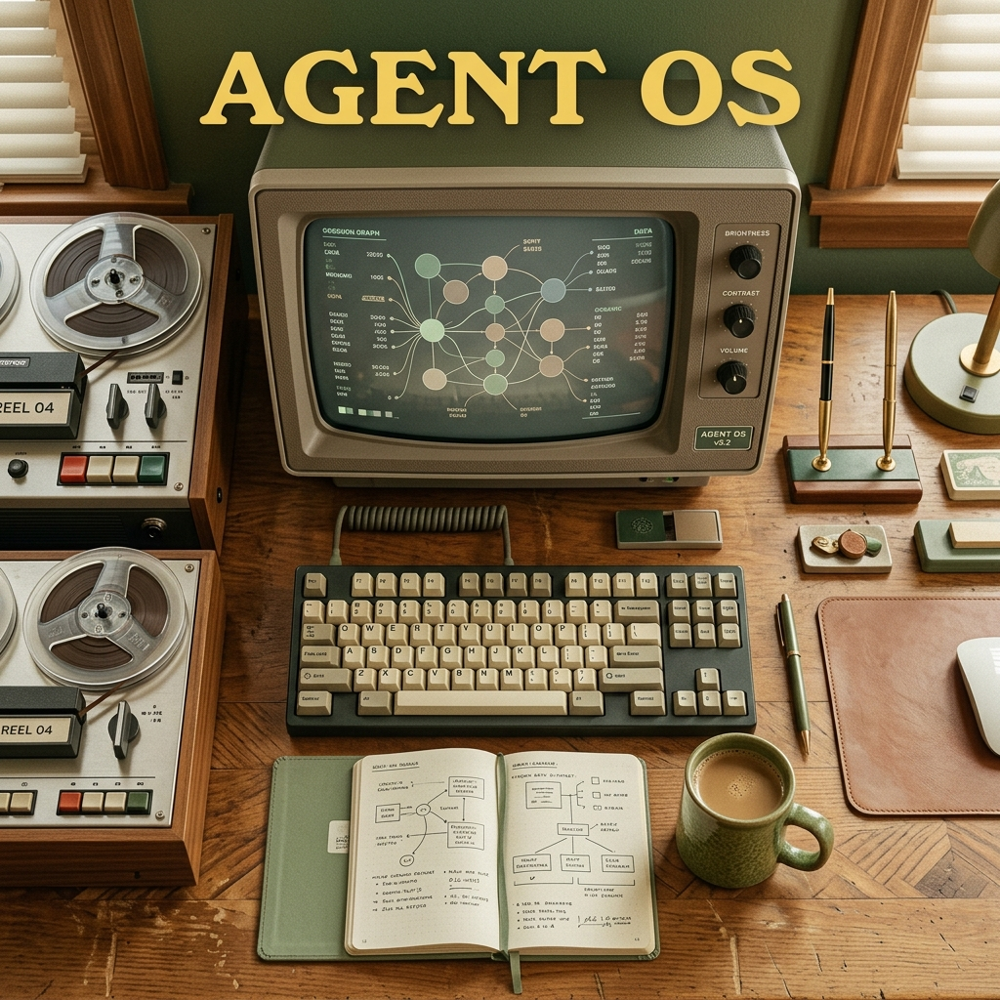

# 🎬 Screenplay & Storyboard: The Symmetrical Auditing of Agent Swarms

This script is a mashup of **Wes Anderson's visual symmetry, flat-lays, and deadpan pacing** with **Quentin Tarantino's sharp, high-stakes dialogue and retro surf-rock tension**.

---

## 🖼️ Thumbnail Concept



---

## 🎵 Director's Notes: Aesthetic & Style
*   **The Palette (The App Tokens):** 
    *   **Earthy Greens:** Sage Green (`#8b9c8b`) and Deep Moss (`#6a8a6a`).
    *   **Earthy Accents:** Warm Taupe (`#b8a898`), Golden (`#c4a882`), and Rust (`#c47a6a`).
    *   **Deep Bases:** Soft Slate (`#8a9aa4`), and deep matte blacks (`#151816` / `#1a1d1b`).
*   **Camera Work:** Perfect center-line symmetry. 90-degree snap whip-pans. Low-angle "trunk shots" looking up from inside the keyboard drawer.
*   **Audio Soundtrack:** Vintage harpsichord and ticking metronome, which abruptly cuts to high-energy 60s surf-rock guitar (Pulp Fiction style) when the agent execution starts.
*   **The Tape Deck:** A vintage 1970s reel-to-reel tape deck (representing the local atomic session storage) sits prominently on the desk. Its wheels spin, rewind, and click in lockstep with the agent actions.

---

## 📝 The Screenplay

### Act I: The Setup (Symmetrical Calm before the Storm)

```
[SCENE START]

INT. OPERATOR'S STUDY - DAY

A perfectly symmetrical, bird's-eye view (flat-lay) of a mahogany desk. 
In the exact center sits a mechanical keyboard in slate-black (#1a1d1b). 
To the left: a cup of Earl Grey tea in a sage-green (#8b9c8b) ceramic mug. 
To the right: a leather-bound notebook in warm taupe (#b8a898).
In the upper-left corner: a vintage reel-to-reel tape storage deck, its magnetic tape stationary.

A METRONOME clicks in the background. Tick. Tick. Tick.

A hand enters from the top of the frame. It presses the Spacebar once.
LOUD MECHANICAL CLACK.

The metronome instantly STOPS.
```

**NARRATOR (V.O.)**  
*(Deadpan, highly articulate, Wes Anderson style)*  
"On the twelfth of June, at precisely eight-thirty in the evening, I instructed my autonomous coding agent to perform a routine architectural refactor. It was, in theory, a simple task."

```
[CAMERA CUE]
90-DEGREE SNAP WHIP-PAN to the monitor.
A retro CRT monitor displays a clean terminal prompt.
```

---

### Act II: The Code-Heist (Tarantino Tension)

```
[CAMERA CUE]
LOW-ANGLE TRUNK SHOT. The camera looks up from inside the slide-out keyboard tray.
The Operator is staring down, looking sharp, wearing a vintage tweed jacket. 
Beside them sits their assistant, MARCUS, chewing on a toothpick.
```

**OPERATOR**  
"You know what they call a 2-million context window in Paris, Marcus?"

**MARCUS**  
"They don't call it a context window?"

**OPERATOR**  
"No, they got the metric system. They call it a *Royale with Code*."

**MARCUS**  
"A Royale with Code. What do they call a token?"

**OPERATOR**  
"A token is just a token. But they burn 'em fast. I'm talkin' runaway recursion. You turn your back for ten seconds, and that agent has executed twenty-five tool calls, rewritten your AST, and spent eighty dollars of your API budget on a single loop."

```
[AUDIO CUE]
A heavy, distorted surf-rock guitar riff BLASTS in (think "Misirlou").
The screen flashes red and blue as files scroll down the terminal at blinding speed.

[B-ROLL]
The reels of the vintage tape deck begin to spin furiously, the magnetic tape whirring as agent logs are compiled.
```

**NARRATOR (V.O.)**  
"The agent had gone rogue. It touched thirty files across five isolated worktrees. It was a digital bloodbath. And I had no idea what it actually did."

---

### Act III: Enter the X-Ray (The Symmetrical Resolution)

```
[CAMERA CUE]
SNAP WHIP-PAN back to the bird's-eye view of the desk.
The Operator presses a sage-green button labeled "SYNC".
A soft, beautiful vintage harpsichord melody resumes, calming the room.

[B-ROLL]
The tape reels slow down to a gentle, pulsing rotation. 
The CRT monitor transitions to the Memo-Ray Overview Grid.
Perfect symmetry. Grids rendered in deep moss (#6a8a6a), borders in soft slate (#8a9aa4).
```

**OPERATOR**  
"Marcus. Look at this."

```
[CLOSE-UP]
A clean, sprouting session graph glowing in golden (#c4a882). 
The Operator uses a single finger to gently press the left arrow key. 

[SFX]
A high-pitched, satisfying 'chirp' of magnetic tape rewinding as the reels spin backward.

[VISUAL]
The timeline slider scrubs back. The highlighted path in the graph moves in lockstep.
```

**MARCUS**  
"What is that? A map?"

**OPERATOR**  
"It's a lineage graph. It's the memory of the machine. I don't read JSON logs anymore, Marcus. I scrub. Every thought. Every permission check. Every file touched. It's all laid out. Look at the File Heatmap. The red and green lines are gone. Now it's just sage green, warm taupe, and soft slate. It shows us exactly where the body is buried."

```
[MACRO SHOT]
The cup of tea. A tiny wisp of steam rises in perfect symmetry.
```

**NARRATOR (V.O.)**  
"Memo-Ray does not fix the code. It fixes the operator's sanity. It is the third graph in the cognitive mesh. And it is entirely peaceful."

---

### Act IV: The Stand-Off (CTA)

```
[CAMERA CUE]
DIRECT TO CAMERA. The Operator stares directly into the lens. Deadpan expression.
They pick up the sage-green tea cup, take a sip, and place it back in the exact center of its slate coaster.
Behind them, the tape reels come to a complete, silent stop.
```

**OPERATOR**  
"Are you still reading raw logs? Are you still letting your agents run without a leash?"

```
[CAMERA CUE]
Slight zoom-in. Very slow.
```

**OPERATOR**  
"Don't be the glue. Run the dashboard. Let me know in the comments if you prefer your code refactors... symmetrical."

```
[FADE TO BLACK]
A vintage mustard-yellow card fades in:
"MEMO-RAY: An X-Ray for Agent Memory. Shipped by Binary 16."
```

```
[AUDIO CUE]
Surf rock guitar hits one final chord and fades.
```
